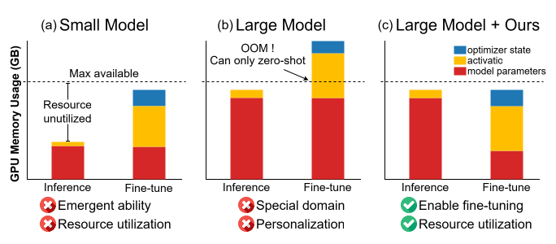
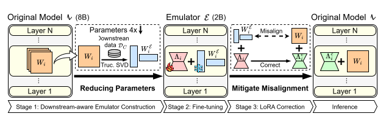

<div align="center">
<h1>EMLoC: Emulator-based Memory-efficient Fine-tuning <br> with LoRA Correction</h1>

[**🏠Project Page**](https://hsi-che-lin.github.io/EMLoC/) | [**🐙Github**](https://github.com/hsi-che-lin/EMLoC/tree/main) | [**📖Paper**](https://arxiv.org/abs/2506.12015)

EMLoC is a framework that enables fine-tuning within the same memory budget required for inference.<br>
In our paper, we demonstrate the ability to fine-tune a 38B model on a single 24GB GPU without quantization.


</div>

## EMLoC Overview
<div align="center">
  
</div>

## Usage (VLM)
### Installation
```shell
conda create -n emloc python=3.9
conda activate emloc
conda install ffmpeg gcc_linux-64=11.4 gxx_linux-64=11.4 gfortran_linux-64=11.4 -c conda-forge
conda install cuda-toolkit -c nvidia/label/cuda-12.4.1
conda install pytorch==2.5.1 torchvision==0.20.1 pytorch-cuda=12.4 -c pytorch -c nvidia
pip install -r requirements.txt
pip install flash-attn==2.7.3 --no-build-isolation
```

### Data Preparation
Prepare the data by following the instruction from [InternVL 2.5 tutorial](https://internvl.readthedocs.io/en/latest/internvl2.5/finetune.html#prepare-customized-data). Examples are provided in the `data` folder.

### Downstream-aware Emulator Construction
Construct 2B emulator from InternVL 2.5 8B with 64 calibration data using the following command
```shell
bash scripts/emulatorConstruct.sh \
    "pretrained/WebSRC/InternVL2_5-8B/8B-to-2B-64" \    # output path
    "pretrained/InternVL2_5-8B" \                       # path to pretrained model
    "data/WebSRC/train.json" \                          # path to the JSON file of downstream data
    "config/compress/8B-to-4B.json" \                   # path to the config file of compression
    "config/calibration/64.json"                        # path to the config file of calibration data
```

### Fine-tuning
Fine-tune the emulator using the following command
```shell
bash scripts/finetune.sh \
    "output/finetune/demo" \                            # output path
    "pretrained/WebSRC/InternVL2_5-8B/8B-to-2B-64" \    # path to the emulator
    "data/WebSRC/train.json" \                          # path to the JSON file of training data
    "config/peft/8B.json" \                             # path to the config file of LoRA
    "config/quantization/default.json" \                # path to the config file of quantization
    "config/training/500-steps.json"                    # path to the config file of training arguments
```

### Inference
Run inference using the original model
```shell
bash scripts/testing.sh \
    "output/testing/demo" \                             # output path
    "output/finetune/demo" \                            # path to the checkpoint
    "data/WebSRC/test.json" \                           # path to the JSON file of testing data
    "pretrained/InternVL2_5-8B"                         # path to the original pretrained model
```

## Usage (Diffusion Model)
`cd` in the `diffusion` folder for this example

### Installation
Installing the dependencies by following the [tutorial](https://github.com/huggingface/diffusers/blob/main/examples/dreambooth/README_flux.md#installing-the-dependencies) in `diffusers`

### Data Preparation
```shell
git clone https://github.com/google/dreambooth.git
```

### Emulator Construction
```shell
python emulatorConstruct.py
```

### Fine-tuning
Launch the training using
```shell
export MODEL_NAME="black-forest-labs/FLUX.1-dev"
export INSTANCE_DIR="dreambooth/dataset/dog"
export INSTANCE_PROMPT="a photo of sks dog"
export OUTPUT_DIR="trained-flux"
export PYTHONPATH=$(pwd)

mkdir -p $OUTPUT_DIR

accelerate launch training/train.py \
  --instance=$INSTANCE \
  --pretrained_model_name_or_path=$MODEL_NAME  \
  --output_dir=$OUTPUT_DIR \
  --mixed_precision="bf16" \
  --instance_data_dir=$INSTANCE_DIR \
  --instance_prompt="${INSTANCE_PROMPT}" \
  --resolution=512 \
  --train_batch_size=1 \
  --guidance_scale=1 \
  --gradient_accumulation_steps=4 \
  --optimizer="prodigy" \
  --learning_rate=1. \
  --lr_scheduler="constant" \
  --lr_warmup_steps=0 \
  --max_train_steps=500 \
  --seed="0" \
  > >(tee -a "${OUTPUT_DIR}/stdout.log") 2> >(tee -a "${OUTPUT_DIR}/stderr.log" >&2)

```

### Inference
```shell
python inference.py
```

## Acknowledgement
* The code for VLM examples is based on [InternVL](https://github.com/OpenGVLab/InternVL).
* The code for diffusion model examples is based on the [example](https://github.com/huggingface/diffusers/blob/main/examples/dreambooth/README_flux.md) in `diffuers`.
* The data for diffusion model examples are from [DreamBooth](https://github.com/google/dreambooth)

## Citation
If you find EMLoC useful or relevant to your research, please cite our paper:
```
@article{lin2025emloc,
  title={EMLoC: Emulator-based Memory-efficient Fine-tuning with LoRA Correction},
  author={Hsi-Che Lin and Yu-Chu Yu and Kai-Po Chang and Yu-Chiang Frank Wang},
  journal={arXiv preprint arXiv:2506.12015},
  year={2025}
}
```
